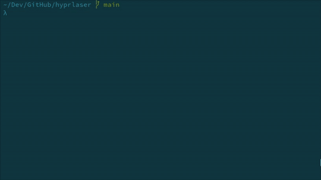

# hyprlaser

[](https://github.com/dcaixinha/hyprlaser/actions/workflows/ci.yml)
[](https://aur.archlinux.org/packages/hyprlaser)

A virtual laser pointer for [Hyprland](https://hypr.land).

<p align="center">
  
</p>

## Why

Presenters in physical rooms point at slides with a laser. Doing the
same over a video call is awkward: a stationary mouse cursor is hard
for viewers to follow, "draw" tools force you to break flow and switch
modes, and most screen-sharing apps don't have a laser feature at all
— or only inside one specific tool (Zoom annotations, Google Slides'
own pointer, etc.) that doesn't extend to whatever else you're
demonstrating.

**hyprlaser turns your entire desktop into a single, consistent
laser-pointer surface.** Run it before you start screen-sharing and
your normal mouse becomes a bright red dot with a fading trail that
your audience can track instantly. It works the same in your slides,
your terminal, your editor, your browser, and any fullscreen app —
because it's a transparent overlay that sits on top of everything.
Click-through means you keep interacting with whatever you're
demonstrating; no mode switch, no muscle memory tax.

It does one thing, and it does it everywhere you're presenting from.

## Features

- **Crisp red dot with a tapering trail**, drawn on the GPU via wgpu.
- **Click-through**: never steals input from apps below — keep working
  while presenting.
- **Multi-monitor**: one overlay per `wl_output`, continuous trail
  across monitor boundaries.
- **HiDPI / fractional scale** via `wp_fractional_scale_v1` +
  `wp_viewporter` (with an integer-scale fallback).
- **System cursor hidden** by default while the laser is up; restored on
  exit (Ctrl+C, panic, or compositor shutdown).
- **Configurable** color, dot size, trail length, tail thickness.

## Requirements

- Hyprland (any reasonably recent version — tested against the current
  `wp_fractional_scale_v1` protocol).
- A Vulkan-capable GPU + drivers (AMD/Intel/NVIDIA Mesa, NVIDIA
  proprietary, etc).

## Install

### Arch Linux (AUR)

```sh
# pick whichever AUR helper you use
yay  -S hyprlaser
paru -S hyprlaser
```

Or build manually from a clone of this repo:

```sh
cd packaging/aur
makepkg -si
```

### From source (any distro)

```sh
cargo install --path .
hyprlaser
```

Or build without installing:

```sh
cargo build --release
./target/release/hyprlaser
```

Press `Ctrl+C` in the terminal to quit.

### Options

```sh
hyprlaser --color crimson           # CSS name, hex, or rgb()/hsl()
hyprlaser --dot-radius 8            # bigger head dot
hyprlaser --tail-half-width 1.0     # thicker tail tip
hyprlaser --trail-ms 300            # shorter streak
hyprlaser --keep-cursor             # don't hide the OS cursor
```

Run `hyprlaser --help` for the full list.

### As a Hyprland keybind

A toggle-style bind is the most useful pattern: tap to start the
laser before sharing your screen, tap again to dismiss it. Add to
your `~/.config/hypr/hyprland.conf`:

```
bind = CTRL SUPER, L, exec, pkill hyprlaser || hyprlaser
```

That starts hyprlaser if it isn't running and kills it if it is. Swap
`CTRL SUPER, L` for whatever shortcut you prefer.

### Logging

Default log filter shows only hyprlaser's own info messages. To see
verbose output:

```sh
RUST_LOG=hyprlaser=debug hyprlaser
```

## How it works

- **Overlay**: one `wlr-layer-shell` `Overlay` surface per output,
  anchored to all four edges with `exclusive_zone = -1` so it sits
  above panels and fullscreen windows.
- **Click-through**: an empty `wl_region` is attached as the input
  region. The compositor passes every pointer event through.
- **Rendering**: a single fullscreen triangle per surface plus a WGSL
  fragment shader that computes the distance from each pixel to a
  polyline (the trail of recent cursor positions). The dot is the
  capsule end-cap at the head; thickness and opacity taper to zero
  along the trail.
- **Cursor tracking**: Hyprland doesn't emit a `mousemove` event on
  its event socket, so we poll `cursorpos` over `.socket.sock` at
  120 Hz from a background thread.
- **Cursor hiding**: `hyprctl keyword cursor:invisible 1` on startup,
  reset on `Drop`. This affects all of Hyprland while the laser is
  running, which is what you want — the red dot replaces the cursor.

## Contributing

Bug reports, feature ideas, and PRs are all welcome.
See [CONTRIBUTING.md](CONTRIBUTING.md) for the setup steps, the
expected pre-PR checks (`cargo fmt`, `cargo clippy`, `cargo test`),
and the rule that user-facing changes should add a
[`CHANGELOG.md`](CHANGELOG.md) entry under `## [Unreleased]`.

## License

Apache-2.0 — see [LICENSE](LICENSE).
